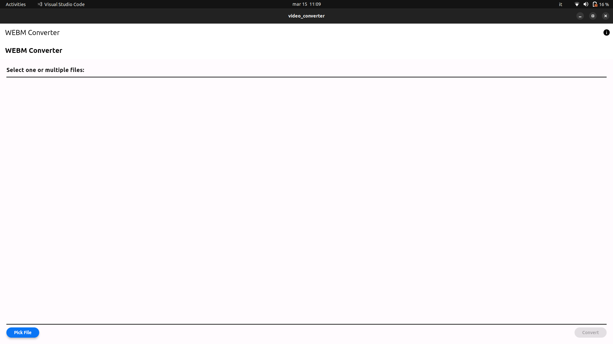
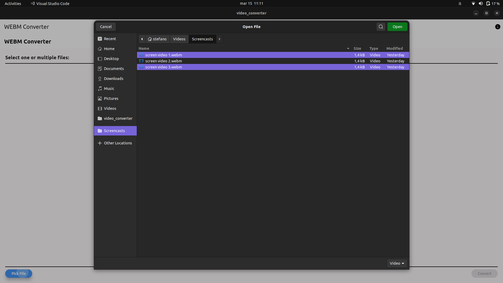
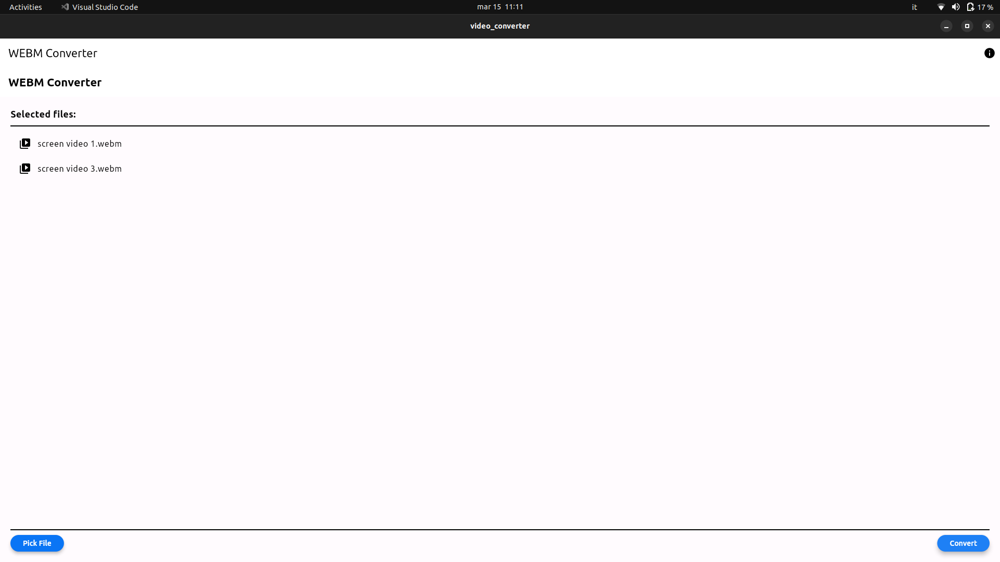

# Video Converter

This repository contains a Flutter app designed to convert WebM files into MP4 format. 
This app currently allows you to convert webm files to mp4 files. This functionality is made possible by ffmpeg, without which the app would not work. While I know this can be done via the terminal, I wanted to contribute to the open-source world by providing a graphical app to do it :)


## INSTALL
Before using the app, ensure that FFmpeg is installed on your system. If not, you can install it using the package manager specific to your Linux distribution:

This way you can install it in Ubuntu:
```bash
sudo apt-get update
sudo apt-get install ffmpeg
```

### Quick Instructions (for users with basic knowledge of Linux systems):

1. Download the repository.
2. Grant execution permissions to the "video_converter" application.
3. Now you can use the video converter.

### Simplified Instructions:

1. Download the repository.
2. Extract the downloaded repository by right-clicking and "extract here".
3. Right-click on the bundle folder and select "Open in terminal."
4. Paste `chmod 777 install.sh` in the terminal (and press Enter).
5. Drag the "install" file into the terminal (and press Enter).
6. Now you can open the "video_converter" file and use the application.

You can follow the installation steps here:
[Video instruction Soon](https://www.youtube.com/)

## CODE AND PROJECT

You can find the code with the project here 
[SOURCE CODE](https://github.com/stefanospin7/video_converter)





## TODO
1. Make the app standalone without the need for FFmpeg installation (potentially using the Flutter FFmpeg package).
2. Fix the window resizing issue.
3. Add support for more video file types for conversion.
4. Extend the app to be compatible with multiple operating systems.
5. Add conversion percentage of the files

Feel free to contribute by addressing these TODO items or by submitting new features and enhancements. Your contributions are highly appreciated!
